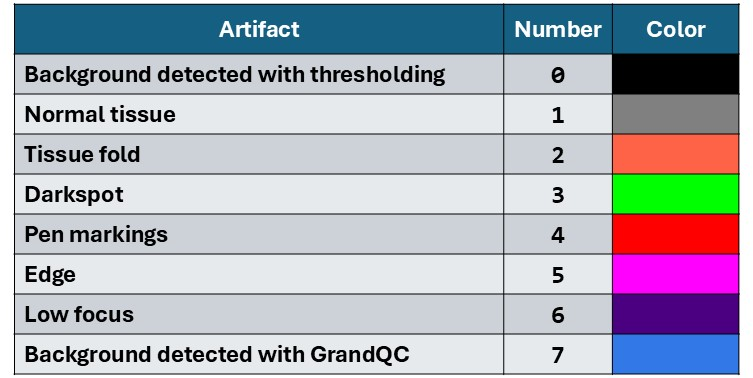
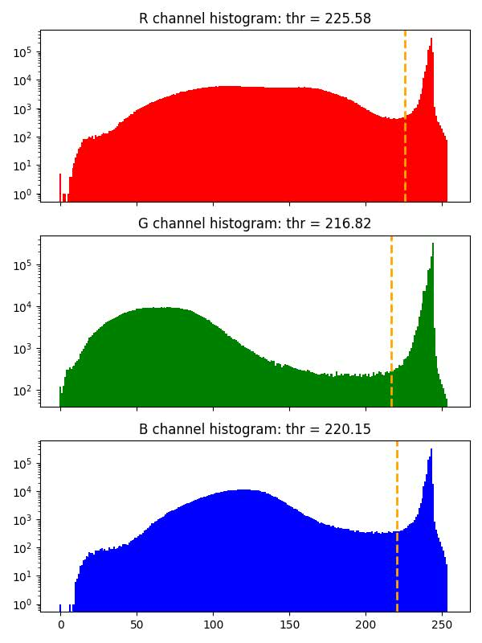
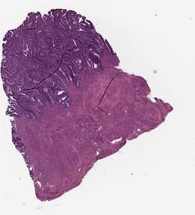
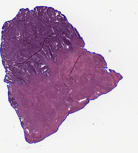
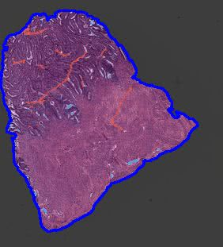

Tissue & Artifacts Detection
===============================

HistoKit provides tissue detection and artifact identification on whole-slide images (WSI). These artifacts may negatively impact both the computational cost and the quality of results produced by downstream image analysis algorithms. Below is a brief description of the methods currently used.

Algorithms description
----------------------

Tissue detection
~~~~~~~~~~~~~~~~

Artifact detection
~~~~~~~~~~~~~~~~~~

Run tissue and artifacts detection
----------------------------------

The script ``run_tissue_seg.py`` is used to execute the tissue segmentation and artifact detection algorithms. Below is a description of the parameters accepted by the script, along with explanations of their functionality.

Configuration
~~~~~~~~~~~~~

Common settings
^^^^^^^^^^^^^^^

.. list-table::
   :header-rows: 1
   :widths: 30 12 12 46

   * - Parameter
     - Type
     - Default
     - Description

   * - ``--wsi_dir``
     - ``str``
     - ``/Data/``
     - Input directory containing WSIs.

   * - ``--out_dir``
     - ``str``
     - ``/Results/``
     - Directory where results will be saved.

   * - ``--vis_mag``
     - ``int``
     - ``0.625``
     - Magnification for saved visualizations.

   * - ``--overwrite``
     - ``bool``
     - ``False``
     - If set, existing output files are overwritten.

Tissue detection settings
^^^^^^^^^^^^^^^^^^^^^^^^^

The tissue detection stage is executed on the CPU. It is possible to increase the number of workers to process multiple .svs files in parallel. However, when doing so, it is important to monitor your system’s RAM usage, particularly when working with large WSI images.

.. list-table::
   :header-rows: 1
   :widths: 36 12 12 45

   * - Parameter
     - Type
     - Default
     - Description

   * - ``--run_tis_det``
     - ``bool``
     - ``True``
     - Run tissue/background detection.

   * - ``--fill_holes``
     - ``bool``
     - ``True``
     - Fill holes inside tissue regions.

   * - ``--close_disk_r``
     - ``int``
     - ``2``
     - Radius for disk kernel during morphological closing.

   * - ``--open_disk_r``
     - ``int``
     - ``2``
     - Radius for disk kernel during morphological opening.

   * - ``--tissdet_mag``
     - ``float``
     - ``2.5``
     - Magnification used for tissue detection.

   * - ``--remove_small_objects``
     - ``bool``
     - ``True``
     - Remove small tissue areas (which are potentially too small for further analysis) after tissue segmentation.

   * - ``--workers``
     - ``int``
     - ``4``
     - Number of workers used during tissue detection.

Artifact detection settings
^^^^^^^^^^^^^^^^^^^^^^^^^^^

The artifact detection stage using the GrandQC model can be accelerated by leveraging CUDA-enabled GPU processing. This stage makes use of the tissue masks obtained from the thresholding-based detection step. This significantly reduces the computation time, as artifact prediction is performed only on regions that contain tissue.

.. list-table::
   :header-rows: 1
   :widths: 30 12 12 46

   * - Parameter
     - Type
     - Default
     - Description

   * - ``--run_artifacts_det``
     - ``bool``
     - ``True``
     - Run artifact detection step.

   * - ``--save_confidence_maps``
     - ``bool``
     - ``True``
     - Save per-class confidence maps.

   * - ``--device``
     - ``str``
     - ``cuda``
     - Device used for inference (``cuda``/``cpu``).

   * - ``--workers_per_slide``
     - ``int``
     - ``6``
     - Number of workers used during patch extraction & batching.

   * - ``--batch_size``
     - ``int``
     - ``64``
     - Mini-batch size for inference.

   * - ``--grandqc_model``
     - ``str``
     - ``../HE/models/GrandQC_MPP1.pth``
     - Path to GrandQC checkpoint.

   * - ``--grandqc_mpp``
     - ``float``
     - ``1.0``
     - Micron-per-pixel for the GrandQC model (1.0 corresponds to 10x magnification).

   * - ``--patch_size_model``
     - ``int``
     - ``512``
     - Patch size for model input.

   * - ``--save_mag``
     - ``float``
     - ``2.5``
     - Magnification for saving final segmentation mask.

   * - ``--encoder_model``
     - ``str``
     - ``timm-efficientnet-b0``
     - Encoder architecture for GrandQC backbone.

   * - ``--encoder_model_weights``
     - ``str``
     - ``imagenet``
     - Pretrained weights for encoder initialization.

   * - ``--overlap``
     - ``float``
     - ``0.75``
     - Overlap ratio between extracted patches.

   * - ``--blending_mode``
     - ``str``
     - ``gaussian``
     - Method for merging overlapping patch predictions.

   * - ``--blending_sigma``
     - ``float``
     - ``None``
     - Sigma used for Gaussian blending (ignored for average mode).

Artifacts Color Mapping
~~~~~~~~~~~~~~~~~~~~~~~

The GrandQC model generates masks with integer values from 0 to 7. During visualization, these values are mapped to corresponding colors. The table below presents the mapping between artifact classes and their visual representations, along with example artifacts marked on the slides. Note that the original model was not trained on some specific tissue types, which may lead to inaccurate artifact segmentation in certain cases.

Output Folders
~~~~~~~~~~~~~~

.. list-table::
   :header-rows: 1
   :widths: 20 60

   * - **Folder name**
     - **Description**

   * - ``masks/``
     - Masks with detected tissue (two classes: background and tissue), saved as ``.mat`` files.

   * - ``masks_grandqc/``
     - Masks with detected artifacts using the GrandQC model, saved as ``.mat`` files.

   * - ``grandqc_confidence_maps/``
     - Confidence maps for each artifact type detected by the GrandQC model, saved as ``.mat`` files.

   * - ``bg_thr_hist/``
     - Histograms of background thresholds used for tissue detection.

   * - ``raw_small/``
     - Tissue images before artifact and background detection (images saved at the magnification specified by the ``--vis_mag`` parameter).

   * - ``bg_removal_contour_vis/``
     - Background removal visualizations with blue contours (images saved at the magnification specified by the ``--vis_mag`` parameter).

   * - ``grandqc_overlay_vis/``
     - Artifact detection results overlaid on tissue regions (images saved at the magnification specified by the ``--vis_mag`` parameter).

Example Results
~~~~~~~~~~~~~~~

masks
^^^^^
Folder containing ``.mat`` files with masks generated during tissue detection.
Each file contains the following fields:

.. list-table::
   :header-rows: 1
   :widths: 20 60

   * - **Key**
     - **Description**

   * - ``basename``
     - Basename of the corresponding tissue image (filename without the ``.svs`` extension).

   * - ``mask_bg``
     - Binary tissue mask (``uint8`` 2D array).
       Tissue pixels are labeled as 1 and background pixels as 0.
       The mask is generated for the entire slide (regions are not separated).

   * - ``ind_WSI``
     - Indices of WSI pyramid levels (MATLAB-style indexing starting at 1).

   * - ``ratio``
     - Scaling ratio for each pyramid level, computed as:
       ``size of largest WSI layer / size of the given layer``.

   * - ``scale_val``
     - Final scale factor applied to masks.
       Computed as: ``mask magnification / magnification of the largest WSI layer``.

   * - ``thr``
     - Threshold values used for tissue detection for the R, G, and B channels.

   * - ``mask_mag``
     - Magnification at which the mask is stored.

   * - ``mpp``
     - Microns-per-pixel (MPP) value of the slide.
       If unavailable in metadata, it is estimated as:
       ``10 / magnification of the largest WSI layer``.

   * - ``mag_l0``
     - Magnification of the largest-resolution WSI layer (highest detail level).

masks_grandqc
^^^^^^^^^^^^^

Folder containing .mat files with masks after tissue detection. Files have the following structure:

.. list-table::
   :header-rows: 1
   :widths: 20 60

   * - **Key**
     - **Description**

   * - ``basename``
     - Basename of the tissue file (filename without the ``.svs`` extension).

   * - ``mask_art``
     - List of artifact masks for each detected region.
       Each element is a ``uint8`` 2D array containing values in the range ``0–7`` corresponding to artifact classes.
       Each region is stored as a separate mask.

   * - ``ind_WSI``
     - Indices of WSI pyramid layers (MATLAB-style indexing starting at 1).

   * - ``ratio``
     - Scaling ratio for each WSI pyramid layer.
       Computed as: ``dimension of the largest layer / dimension of the given layer``.

   * - ``scale_val``
     - Scale factor applied to masks, computed as:
       ``mask magnification / magnification of the largest WSI layer``.

   * - ``thr``
     - Threshold values used for tissue/background detection for the R, G, and B channels.

   * - ``bbox``
     - List of bounding box coordinates for each region.
       Coordinates follow Python indexing (starting at 0).

   * - ``mask_mag``
     - Magnification at which the masks are stored.

   * - ``mpp``
     - Microns-per-pixel (MPP) value of the slide.
       If metadata does not include MPP, it is estimated as:
       ``10/magnification of the largest WSI layer``

   * - ``mag_l0``
     - Magnification of the largest-resolution WSI layer (highest detail level).

grandqc_confidence_maps
^^^^^^^^^^^^^^^^^^^^^^^

Folder containing .mat files with masks after tissue detection. Files have the following structure:

.. list-table::
   :header-rows: 1
   :widths: 20 60

   * - **Key**
     - **Description**

   * - ``basename``
     - Basename of the tissue file (filename without the ``.svs`` extension).

   * - ``mask_conf``
     - List of confidence score maps for artifact classes for each region.
       Each element is a ``uint8`` 3D array with dimensions *(width × height × n_classes)*.
       Each slice along the third dimension corresponds to the confidence map for one artifact type.
       Each region is stored as a separate 3D mask. Confidence scores are scaled to integer values from 0 to 255 
       and can be displayed as a binary image. For background detected during the thresholding (0 layer) background is 
       white (255 - 100% confidence that pixel belongs to the background) and the tissue area is black (0 - no background).

   * - ``ind_WSI``
     - Indices of WSI pyramid layers (MATLAB-style indexing starting at ``1``).

   * - ``ratio``
     - Scaling ratio for each WSI pyramid level, computed as:
       *dimension of the largest layer / dimension of the given layer.*

   * - ``scale_val``
     - Scale factor applied to the masks, computed as:
       *mask magnification / magnification of the largest WSI layer (``mag_l0``)*.

   * - ``thr``
     - Threshold values used for tissue/background detection for the R, G, and B channels.

   * - ``bbox``
     - List of bounding box coordinates for each region.
       Coordinates follow Python indexing (starting at ``0``).

   * - ``mask_mag``
     - Magnification at which the confidence maps are stored.

   * - ``mpp``
     - Microns-per-pixel (MPP) value of the slide.
       If metadata does not include MPP, it is estimated as:
       *10 / magnification of the largest WSI layer.*

   * - ``mag_l0``
     - Magnification of the highest-resolution WSI layer.

bg_thr_hist
^^^^^^^^^^^

Histograms with background threshold values for each color channel calculated with GaMRed algorithm, or with Otsu method when threshold obtained with GaMRed is too small (smaller than ``0.7*255``).

raw_small
^^^^^^^^^

Original tissue image saved with the magnification defined by the ``--vis_mag`` parameter.

bg_removal_contour_vis
^^^^^^^^^^^^^^^^^^^^^^

In this folder, the visualizations of tissue detection using the thresholding methods are stored. The contours of detected tissue are drawn on the original image. Image is saved with the magnification defined by the ``--vis_mag`` parameter.

grandqc_overlay_vis
^^^^^^^^^^^^^^^^^^^

In this folder, the visualizations of artifact detection using the GrandQC model are stored. The original image is overlaid with the generated artifact mask, and then the contours of the detected tissue are drawn. Image is saved with the magnification defined by the ``--vis_mag`` parameter.

How to Load Regions to Matlab?
------------------------------

Generated artifacts maps are saved to .mat files which can be loaded both with Matlab and Python.
The following function can be used to load .mat files generated during artifacts detection step to Matlab.

.. code-block:: matlab

    function [img,mask_all] = load_tiss_masked_histokit(svs_name,mask_name,reg_ID, qual_ind, exclude_art)
    % svs_name - name of the svs file
    % mask_name - name of the corresponding .mat file
    % reg_ID - region ID
    % qual_ind - index for wsi layer
    % exclude_art - vector of artifacts to exclude:

    % BG_THR = 0       # BACKGROUND (after mask detection): black
    % NORM = 1         # ART_NORM: gray
    % ART_FOLD = 2     # ART_FOLD: orange
    % ART_DARKSPOT = 3 # ART_DARKSPOT: green
    % ART_PEN = 4      # ART_PEN: red
    % ART_EDGE = 5     # ART_EDGE: pink
    % ART_FOCUS = 6    # ART_FOCUS: violet
    % BG_MODEL = 7     # BACKGROUND (predicted by artifact detection model): blue

    % load info about mask
    load(mask_name,'mask_art','ratio','bbox',...
        'ind_WSI','scale_val')

    % calculate scaling value for selected image resolution mask
    scale_val = scale_val*ratio(ind_WSI == qual_ind);

    % get bounding box for the region and resize
    Box = (bbox(reg_ID,:)+1) / scale_val;

    % get location of the region and load image
    rows = [Box(1), Box(3)];
    cols = [Box(2), Box(4)];

    region = {rows,cols};
    img = imread(svs_name,'Index',qual_ind,'PixelRegion',region);
    figure;image(img)

    % get mask of region, resize and apply to image
    mask_all = uint8(imresize(mask_art{reg_ID},[size(img,1),size(img,2)]));

    % variants we want to exclude are set to 0
    mask_all(ismember(mask_all, exclude_art))=0;
    mask_all(~ismember(mask_all, exclude_art))=1;

    for b=1:size(img,3)
        tmp = img(:,:,b).*mask_all;
        tmp(mask_all == 0) = 255;
        img(:,:,b) = tmp;
    end
    clear tmp
    figure;image(img)

    end

Example usage:

.. code-block:: matlab

   % search for original .svs file
   svs_name = "224-20_he.svs";
   mask_name = "224-20_he.mat";
   
   % check how many regions are there
   load(mask_name, "bbox")
   load(mask_name, "ind_WSI")
   n3 = size(bbox,1);
   
   %iterate over regions
   for b=1:n3
   
       % load region with 10x magnification, that is why are using ind_WSI(2) for our WSI
       exclude_art = [0, 2, 3, 4, 5, 6, 7];
       img = load_tiss_masked_histokit(svs_name,mask_name,b,ind_WSI(2), exclude_art);
       imshow(img);
   end

References
----------

- Z. Weng, A. Seper, A. Pryalukhin, *et al.*  
  *GrandQC: A comprehensive solution to quality control problem in digital pathology.*  
  *Nature Communications* **15**, 10685 (2024).  
  `DOI <https://doi.org/10.1038/s41467-024-54769-y>`_ | `GitHub <https://github.com/cpath-ukk/grandqc>`_

- M. Marczyk, A. Wrobel, J. Merta, and J. Polanska (2025).  
  *Post-Processing of Thresholding or Deep Learning Methods for Enhanced Tissue Segmentation of Whole-Slide Histopathological Images.*  
  In: *Proceedings of the 18th International Joint Conference on Biomedical Engineering Systems and Technologies* – Volume 1: BIOIMAGING.  
  SciTePress, pp. 229–238. ISBN 978-989-758-731-3.  
  `DOI <https://doi.org/10.5220/0013174700003911>`_ | `GitHub <https://github.com/ZAEDPolSl/WSI_TissueSeg>`_

